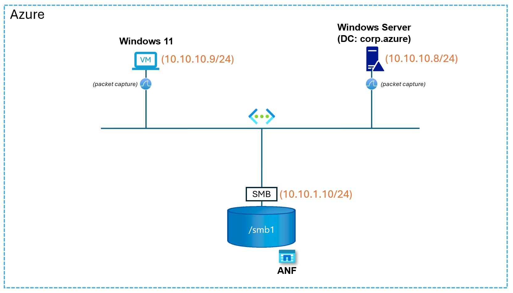
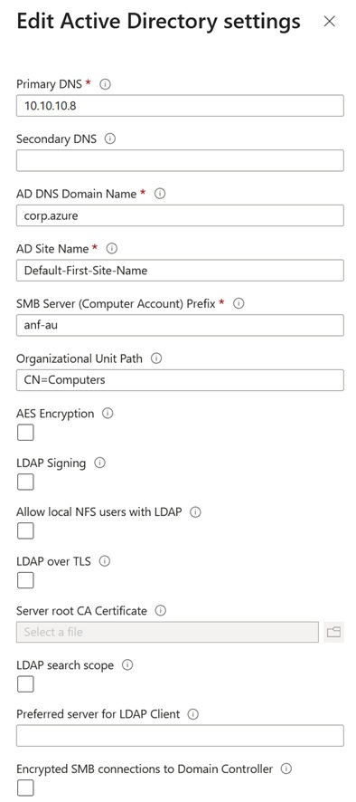
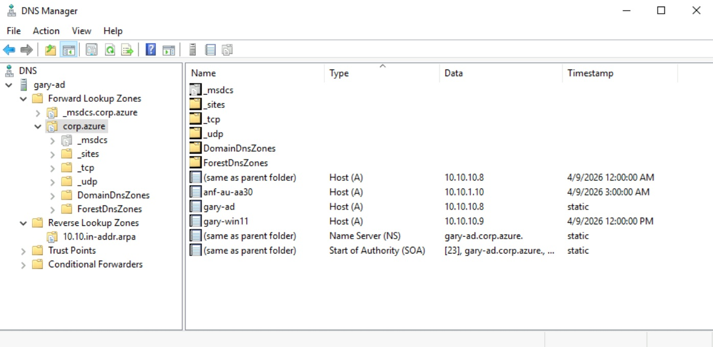
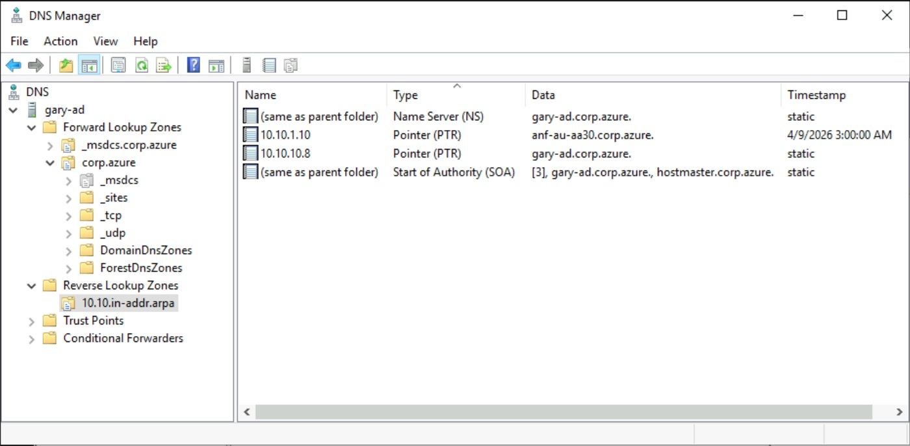
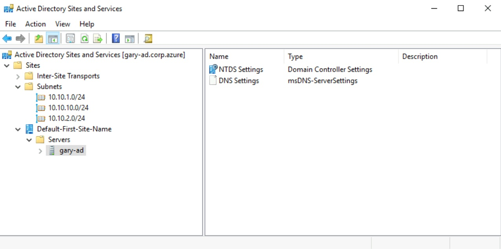
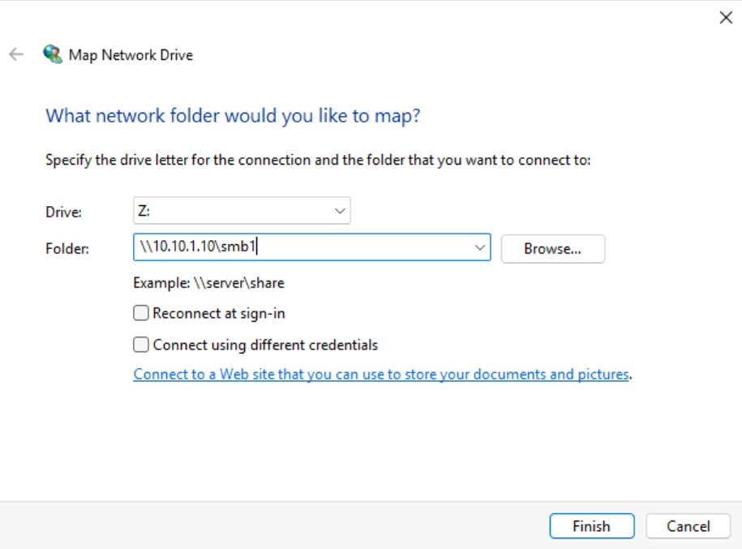

# ANF SMB Volume Creation — AD Integration Flow

**Captured environment:** Windows Server 2019 DC  
**ANF node:** `10.10.1.10`  
**AD Domain Controller:** `10.10.10.8` (gary-ad.corp.azure)  
**Domain:** corp.azure  
**Computer account created:** `ANF-AU-AA30`

---

## Lab Setup

All components are deployed in Azure within a single VNet:

- **Windows 11 VM** (`10.10.10.9/24`) — client used to map and test the SMB volume; packet captures taken here
- **Windows Server 2019 DC** (`10.10.10.8/24`) — Active Directory domain controller for `corp.azure`; packet captures taken here
- **ANF SMB volume** (`10.10.1.10/24`) — Azure NetApp Files node hosting the `/smb1` SMB share; domain-joined as `ANF-AU-AA30`



---

## ANF Active Directory Connection Configuration

The ANF AD connection was configured in the Azure portal with the following settings, which directly correspond to the Windows AD environment above:



| Setting | Value | Notes |
|---------|-------|-------|
| Primary DNS | `10.10.10.8` | IP address of the Windows Server DC |
| AD DNS Domain Name | `corp.azure` | Domain FQDN |
| AD Site Name | `Default-First-Site-Name` | Must match the AD Sites and Services site name |
| SMB Server (Computer Account) Prefix | `anf-au` | Prefix used to generate the machine account name (`ANF-AU-AA30`) |
| Organizational Unit Path | `CN=Computers` | Default Computers container in AD |
| LDAP Signing | Unchecked | Windows Server 2019 DC does not enforce LDAP signing by default |
| LDAP over TLS | Unchecked | Plain LDAP port 389 used throughout the capture |
| AES Encryption | Unchecked | RC4 accepted; enabling AES requires the DC to have AES keys for the account |

---

## Introduction — Role of DNS, Kerberos, and LDAP

Creating an ANF SMB volume is not a simple file-share operation. ANF must fully join the Active Directory domain as a first-class member — the same way a Windows Server would. Three protocols work together in sequence to make this happen.

### DNS — The Navigation Layer

DNS is the first protocol ANF uses and the foundation everything else depends on. Before any authentication or directory operation can occur, ANF must answer two questions:

1. **Where is the domain controller?** — ANF queries DNS SRV records (`_kerberos._tcp.dc._msdcs.CORP.AZURE`, `_ldap._tcp.Default-First-Site-Name._sites.CORP.AZURE`) to locate a DC by name.
2. **What IP does that DC have?** — A follow-up A record query resolves the DC hostname to an IP address.



DNS also serves a critical security role during Kerberos: ANF performs a **reverse PTR lookup** on the DC's IP address to construct the Kerberos Service Principal Name (SPN). If the PTR record is missing, wrong, or returns an IPv6 address, Kerberos cannot build the SPN and the entire domain join fails — even though forward DNS is healthy. This is why the reverse lookup zone and PTR record are mandatory prerequisites, not optional configurations.



AD Sites and Services extends DNS by publishing **site-scoped SRV records**. ANF uses these to select a DC that is topologically close (in the same Azure region/subnet), avoiding cross-region Kerberos and LDAP latency.



### Kerberos — The Authentication Layer

Once DNS has resolved the DC location, ANF authenticates using **Kerberos** — a ticket-based protocol where passwords are never transmitted over the network. The exchange works in two stages:

1. **TGT (Ticket Granting Ticket):** ANF presents its identity to the Key Distribution Center (KDC, running on the DC at port 88) with an encrypted timestamp as proof. The KDC responds with a TGT — a time-limited credential that proves ANF is who it claims to be.
2. **Service Ticket:** ANF presents the TGT back to the KDC and requests a specific service ticket (e.g., for `ldap/gary-ad.corp.azure` or `cifs/gary-ad.corp.azure`). The KDC issues a service ticket encrypted with the target service's key.

Kerberos is used four times during SMB volume creation:
- To authenticate ANF's AD connection account for LDAP (Phase 4)
- To open the SMB2/IPC$ session for LSARPC domain SID lookup (Phase 7)
- To obtain a ticket for the KPASSWD service to set the machine account password (Phase 8)
- To establish the Netlogon secure channel and the SMB volume's domain identity (Phases 10–11)

Clock synchronisation is critical: Kerberos rejects any ticket where the client and server clocks differ by more than **5 minutes** (`KRB_AP_ERR_SKEW`). The domain controller must sync with a reliable NTP source.

### LDAP — The Directory Operations Layer

With a valid Kerberos service ticket, ANF opens an authenticated LDAP session (port 389) to the DC using **SASL GSS-API** — a standardised mechanism that wraps the Kerberos ticket inside the LDAP bind request. This proves identity without re-sending credentials.

Over this authenticated session, ANF performs all Active Directory operations required to provision the SMB volume:

| Operation | Purpose |
|-----------|---------|
| Anonymous Root DSE read | Discover domain naming context and DC capabilities |
| Site SRV lookup (via DNS) | Select the site-local DC for all further operations |
| Authenticated bind | Establish a secure, identity-verified LDAP session |
| OU and partition discovery | Confirm target container exists before writing |
| `addRequest` — computer account | Create the ANF machine account (`CN=ANF-AU-AA30`) in AD |
| `modifyRequest` — set attributes | Write SPNs, `dnsHostName`, and `userAccountControl` flags |

LDAP is also subject to **channel binding and signing policies** on the DC. If the DC requires LDAP signing or channel binding (enforced by default on Windows Server 2025), ANF's plain-port-389 SASL bind will be rejected — producing the misleading *"PTR record missing"* error even when DNS is correct.

---

## End-to-End Flow (Mermaid Sequence Diagram)

```mermaid
sequenceDiagram
    participant ANF as ANF Node<br/>10.10.1.10
    participant DNS as DNS / DC<br/>10.10.10.8
    participant KDC as Kerberos KDC<br/>10.10.10.8 :88
    participant LDAP as LDAP / AD<br/>10.10.10.8 :389
    participant SMB as SMB / DC<br/>10.10.10.8 :445
    participant KPW as KPASSWD<br/>10.10.10.8 :464

    rect rgb(1, 27, 61)
        Note over ANF,DNS: Phase 1 — Domain & DC Discovery
        ANF->>DNS: A example.corp.azure?
        DNS-->>ANF: NXDOMAIN (confirms DNS is authoritative)
        ANF->>DNS: SRV _kerberos._tcp.dc._msdcs.CORP.AZURE?
        DNS-->>ANF: gary-ad.corp.azure:88
        ANF->>DNS: A gary-ad.corp.azure?
        DNS-->>ANF: 10.10.10.8
    end

    rect rgb(66, 94, 74)
        Note over ANF,LDAP: Phase 2 — Anonymous LDAP Root DSE Probe (×3)
        ANF->>LDAP: bindRequest (anonymous simple)
        LDAP-->>ANF: bindResponse: success
        ANF->>LDAP: searchRequest "<ROOT>" baseObject
        LDAP-->>ANF: searchResEntry [defaultNamingContext, supported features]
        ANF->>LDAP: unbindRequest
        Note over ANF,LDAP: Repeated on 2 more independent connections
    end

    rect rgb(83, 76, 49)
        Note over ANF,DNS: Phase 3 — AD Site-Aware DC Discovery
        ANF->>DNS: SRV _ldap._tcp.Default-First-Site-Name._sites.dc._msdcs.CORP.AZURE?
        DNS-->>ANF: gary-ad.corp.azure:389
        ANF->>DNS: SRV _ldap._tcp.Default-First-Site-Name._sites.CORP.AZURE?
        DNS-->>ANF: gary-ad.corp.azure:389
        ANF->>DNS: SRV _kerberos._tcp.Default-First-Site-Name._sites.CORP.AZURE?
        DNS-->>ANF: gary-ad.corp.azure:88
    end

    rect rgb(94, 66, 61)
        Note over ANF,KDC: Phase 4 — Kerberos Authentication (TGT + LDAP Service Ticket)
        ANF->>KDC: AS-REQ (no pre-auth)
        KDC-->>ANF: KRB5KDC_ERR_PREAUTH_REQUIRED (normal — DC requests proof)
        ANF->>KDC: AS-REQ (with encrypted timestamp pre-auth)
        KDC-->>ANF: AS-REP — TGT issued
        ANF->>KDC: TGS-REQ (request ticket for ldap/gary-ad.corp.azure)
        KDC-->>ANF: TGS-REP — LDAP service ticket issued
    end

    rect rgb(94, 60, 139)
        Note over ANF,LDAP: Phase 5 — Authenticated LDAP Bind (SASL/Kerberos)
        ANF->>LDAP: bindRequest (SASL GSS-API + Kerberos service ticket)
        LDAP-->>ANF: bindResponse: success
        ANF->>LDAP: searchRequest "<ROOT>" baseObject
        LDAP-->>ANF: searchResEntry [5 results — naming contexts]
        ANF->>LDAP: searchRequest cn=Partitions,CN=Configuration,DC=corp,DC=azure
        LDAP-->>ANF: searchResEntry CN=CORP partition info
        ANF->>LDAP: searchRequest CN=Computers,dc=CORP,dc=AZURE (verify OU)
        LDAP-->>ANF: searchResEntry CN=Computers [exists]
        ANF->>LDAP: searchRequest dc=CORP,dc=AZURE wholeSubtree (check for existing account)
        LDAP-->>ANF: searchResDone success [no pre-existing ANF account]
    end

    rect rgb(25, 101, 85)
        Note over ANF,LDAP: Phase 6 — Computer Account Creation
        ANF->>LDAP: addRequest "cn=ANF-AU-AA30,CN=Computers,dc=CORP,dc=AZURE"
        LDAP-->>ANF: addResponse: success
        ANF->>LDAP: searchRequest (verify ANF-AU-AA30 exists)
        LDAP-->>ANF: searchResEntry CN=ANF-AU-AA30 [confirmed]
    end

    rect rgb(100, 70, 20)
        Note over ANF,SMB: Phase 7 — LSARPC Domain SID Lookup (via SMB2/IPC$)
        ANF->>SMB: SMB2 Negotiate
        SMB-->>ANF: Negotiate Response
        ANF->>SMB: Session Setup Request (Kerberos ticket)
        SMB-->>ANF: Session Setup Response
        ANF->>SMB: Tree Connect \\gary-ad.corp.azure\ipc$
        SMB-->>ANF: Tree Connect Response
        ANF->>SMB: Create lsarpc + DCE/RPC Bind (LSARPC V0.0)
        SMB-->>ANF: Bind_ack (Acceptance)
        ANF->>SMB: lsa_OpenPolicy2 request
        SMB-->>ANF: lsa_OpenPolicy2 response
        ANF->>SMB: lsa_LookupSids2 request (×3 domain SIDs)
        SMB-->>ANF: lsa_LookupSids2 responses (SIDs resolved)
    end

    rect rgb(77, 53, 25)
        Note over ANF,KPW: Phase 8 — KPASSWD — Set Machine Account Password
        ANF->>KDC: TGS-REQ (request ticket for kadmin/changepw)
        KDC-->>ANF: TGS-REP — KPASSWD service ticket
        ANF->>KPW: KPASSWD Request (set machine account password)
        KPW-->>ANF: KPASSWD Reply: success
    end

    rect rgb(29, 56, 95)
        Note over ANF,LDAP: Phase 9 — Finalise Computer Account Attributes
        ANF->>LDAP: searchRequest CN=ANF-AU-AA30 (get current attributes)
        LDAP-->>ANF: searchResEntry CN=ANF-AU-AA30
        ANF->>LDAP: modifyRequest CN=ANF-AU-AA30 (set SPNs, userAccountControl, dnsHostName)
        LDAP-->>ANF: modifyResponse: success
        ANF->>LDAP: unbindRequest (close authenticated session)
    end

    rect rgb(80, 20, 80)
        Note over ANF,SMB: Phase 10 — Netlogon Secure Channel Establishment
        ANF->>KDC: AS-REQ (no pre-auth) — machine account credential
        KDC-->>ANF: KRB5KDC_ERR_PREAUTH_REQUIRED
        ANF->>KDC: AS-REQ (with pre-auth)
        KDC-->>ANF: AS-REP — machine account TGT
        ANF->>KDC: TGS-REQ (ticket for cifs/GARY-AD)
        KDC-->>ANF: TGS-REP — service ticket
        ANF->>SMB: SMB2 Negotiate + Session Setup (machine identity)
        SMB-->>ANF: Session Setup Response
        ANF->>SMB: Tree Connect \\GARY-AD\ipc$ + Create NETLOGON
        SMB-->>ANF: Create Response
        ANF->>SMB: DCE/RPC Bind RPC_NETLOGON V1.0
        SMB-->>ANF: Bind_ack (Acceptance)
        ANF->>SMB: NetrServerReqChallenge (ANF-AU-AA30)
        SMB-->>ANF: NetrServerReqChallenge response (server challenge)
        ANF->>SMB: NetrServerAuthenticate2 (credential + flags)
        SMB-->>ANF: NetrServerAuthenticate2 response — secure channel active
    end

    rect rgb(24, 66, 24)
        Note over ANF,KDC: Phase 11 — SMB Volume Kerberos Identity
        ANF->>KDC: AS-REQ (no pre-auth) — volume identity
        KDC-->>ANF: KRB5KDC_ERR_PREAUTH_REQUIRED (normal)
        ANF->>KDC: AS-REQ (with pre-auth)
        KDC-->>ANF: AS-REP — TGT for volume identity
        ANF->>KDC: TGS-REQ (request SMB service ticket)
        KDC-->>ANF: TGS-REP — SMB service ticket
        ANF->>SMB: SMB2 Session Setup (volume identity)
        SMB-->>ANF: SMB2 Session Setup Response
    end

    rect rgb(66, 25, 25)
        Note over ANF,DNS: Phase 12 — Ongoing Site-Aware DC Keepalive
        loop Per SMB node refresh
            ANF->>DNS: SRV _ldap._tcp.Default-First-Site-Name._sites.CORP.AZURE?
            DNS-->>ANF: gary-ad.corp.azure:389
            ANF->>DNS: SRV _ldap._tcp.Default-First-Site-Name._sites.dc._msdcs.CORP.AZURE?
            DNS-->>ANF: gary-ad.corp.azure:389
        end
    end
```



---

## Phase-by-Phase Explanation

### Phase 1 — Domain & DC Discovery

ANF validates DNS reachability and discovers the DC location.

| Frames | Query | Response | Purpose |
|--------|-------|----------|---------|
| 12830–12831 | A `example.corp.azure` | NXDOMAIN | Confirms DNS is reachable and authoritative for `corp.azure` |
| 12866–12867 | SRV `_kerberos._tcp.dc._msdcs.CORP.AZURE` | `gary-ad.corp.azure:88` | Locates a KDC for the domain |
| 12868–12869 | A `gary-ad.corp.azure` | `10.10.10.8` | Resolves the KDC hostname to an IP address |

**Why the DNS A record is critical:**  
SRV records return hostnames, not IPs. ANF resolves the SRV target with a follow-up A query. If the A record is missing or wrong, ANF cannot open a TCP connection to the DC even though DC discovery succeeded.

---

### Phase 2 — Anonymous LDAP Root DSE Probe

ANF opens a plain LDAP connection (port 389) with an **anonymous simple bind** to read the Root DSE — the DC's public capability advertisement. Three separate anonymous connections are made from different source ports (`19718`, `57030`, `55314`), each performing the same Root DSE query independently.

- Retrieves: `defaultNamingContext` (`DC=corp,DC=azure`), supported LDAP versions, domain FQDN
- This probe is unauthenticated — any reachable DC responds without credentials
- Each connection terminates with an `unbindRequest` before the next phase begins

**Why this step exists:**  
ANF reads `defaultNamingContext` and confirms it matches the configured domain before investing in Kerberos. The multiple independent connections reflect parallel ANF SMB subsystem probes confirming site and domain consistency.

---

### Phase 3 — AD Site-Aware DC Discovery

After confirming the domain, ANF queries for **site-scoped** SRV records using the AD site name `Default-First-Site-Name`:

| DNS Query | Purpose |
|-----------|---------|
| `_ldap._tcp.Default-First-Site-Name._sites.dc._msdcs.CORP.AZURE` | LDAP-capable DC in the configured site |
| `_ldap._tcp.Default-First-Site-Name._sites.CORP.AZURE` | Any LDAP server in the site |
| `_kerberos._tcp.Default-First-Site-Name._sites.CORP.AZURE` | KDC in the site |

**Why AD Sites and Services is critical:**  
These SRV records only exist when subnets are mapped to a site in **AD Sites and Services**. Without subnet-to-site mapping:
- Site-scoped SRV queries return NXDOMAIN
- ANF falls back to domain-wide DC selection, which may select a distant or wrong DC
- In multi-DC environments, inconsistent DC selection causes intermittent failures

**Required configuration:**
- A Site object (e.g., `Default-First-Site-Name`)
- Subnet objects for all Azure subnets linked to that site:
  - `10.10.10.0/24` — workload subnet
  - `10.10.1.0/24` — ANF delegated subnet
  - `10.10.2.0/24` — other subnets
- DC placed into the same site

---

### Phase 4 — Kerberos Authentication

ANF authenticates to the DC using Kerberos. No passwords are sent over the wire.

| Frames | Exchange | Outcome |
|--------|----------|---------|
| 12923–12924 | AS-REQ (no pre-auth) → `KRB5KDC_ERR_PREAUTH_REQUIRED` | Normal — DC challenges for proof of identity |
| 12934–12935 | AS-REQ (encrypted timestamp) → AS-REP | **TGT issued** |
| 12961–12963 | TGS-REQ → TGS-REP | **LDAP service ticket issued** |

**Why the PTR record is critical:**  
To build the LDAP Kerberos Service Principal Name (`ldap/gary-ad.corp.azure`), ANF takes the DC's IP (`10.10.10.8`) and performs a **reverse DNS lookup**. The PTR record must:
- Exist in a reverse lookup zone on the AD DNS server
- Return the exact FQDN: `gary-ad.corp.azure` (not a short name, not an IPv6 address)

If the PTR record is missing or returns an incorrect value, Kerberos SPN construction fails and the authenticated LDAP bind in Phase 5 cannot proceed.

**Why NTP/clock sync matters:**  
Kerberos rejects tickets with a timestamp difference greater than **5 minutes** from the DC clock (`KRB5KRB_AP_ERR_SKEW`). The DC must sync to a reliable time source (e.g., `time.windows.com`).

---

### Phase 5 — Authenticated LDAP Bind (SASL/Kerberos)

ANF uses the LDAP service ticket from Phase 4 to perform a **SASL GSS-API bind** — a cryptographically authenticated LDAP session.

| Frames | Exchange | Outcome |
|--------|----------|---------|
| 12974–12976 | `bindRequest (SASL)` | `bindResponse: success` |
| 12977–12978 | `searchRequest <ROOT>` | Returns naming contexts and supported controls |
| 12979–12980 | `searchRequest cn=Partitions,CN=Configuration` | Returns `CN=CORP` — confirms domain partition |
| 12981–12982 | `searchRequest CN=Computers,dc=CORP,dc=AZURE` | Confirms the target OU exists and is accessible |
| 12983–12984 | `searchRequest dc=CORP,dc=AZURE` (subtree) | Checks for any pre-existing ANF computer account |

**Why the SASL bind is the key gate:**  
All subsequent AD operations (account creation, modification) run over this authenticated LDAP session. If the SASL bind fails, nothing beyond Phase 4 can proceed.

---

### Phase 6 — Computer Account Creation

ANF creates its own computer object in Active Directory using the authenticated LDAP session.

| Frames | Operation | Outcome |
|--------|-----------|---------|
| 12985 | `addRequest "cn=ANF-AU-AA30,CN=Computers,dc=CORP,dc=AZURE"` | — |
| 12986 | `addResponse` | **success** — computer object created |
| 12987–12988 | `searchRequest` (verify) | Returns `CN=ANF-AU-AA30` — confirmed in AD |

The computer name `ANF-AU-AA30` is derived from the `--smb-server-name` prefix in the ANF AD connection combined with a generated suffix. This object represents the ANF SMB server identity in the domain.

**Why the service account needs Create Computer Objects permission:**  
The ANF AD connection username performs the `addRequest`. If the account lacks the right to create computer objects in the target OU, `addResponse` returns `insufficientAccessRights` (LDAP result code 50).

---

### Phase 7 — LSARPC Domain SID Lookup (via SMB2/IPC$)

Immediately after the computer account is created in LDAP, ANF opens a new SMB2 session to the DC's `IPC$` share and binds the **LSARPC** (Local Security Authority RPC) pipe to resolve domain Security Identifiers (SIDs).

| Frames | Protocol | Exchange |
|--------|----------|---------|
| 12994–12995 | SMB2 | Negotiate → Response |
| 12999–13001 | SMB2 | Session Setup (Kerberos) → Response |
| 13002–13003 | SMB2 | Tree Connect `\\gary-ad.corp.azure\ipc$` → Response |
| 13004–13009 | SMB2 + LSARPC | Create `lsarpc` → DCE/RPC Bind (LSARPC V0.0) → Bind_ack |
| 13010–13013 | LSARPC | `lsa_OpenPolicy2` request → response (policy handle obtained) |
| 13014–13025 | LSARPC | Three rounds of `lsa_LookupSids2` request/response |

**Why domain SID resolution is needed:**  
ANF must know the domain's SID (`S-1-5-21-...`) to:
- Set correct ACL entries on the SMB share using well-known domain SIDs
- Map NFS UIDs/GIDs to AD SIDs for dual-protocol volumes
- Construct the machine account's full SID (`domain SID + RID`)

`lsa_LookupSids2` converts binary SIDs to their domain+account-name representations. ANF performs three separate lookups covering the domain SID and well-known SIDs (e.g., BUILTIN, NT AUTHORITY).

**Why port 445 must be open for LSARPC:**  
LSARPC has no dedicated port — it is multiplexed through SMB2/IPC$ on TCP 445. If port 445 is blocked between the ANF subnet and the DC subnet, LSARPC fails silently: LDAP can succeed but the volume will fail during domain SID resolution.

---

### Phase 8 — KPASSWD — Set Machine Account Password

With the computer account created and domain SIDs resolved, ANF sets the machine account password using the **Kerberos Password Change (KPASSWD)** protocol.

| Frames | Protocol | Port | Exchange |
|--------|----------|------|---------|
| 13032–13035 | KRB5 | 88 | TGS-REQ/REP — obtain ticket for `kadmin/changepw` |
| 13075–13082 | KPASSWD | 464 | KPASSWD Request → Reply: success |

**Why port 464 must be open:**  
KPASSWD is a distinct protocol (RFC 3244) on TCP/UDP 464. If the ANF delegated subnet is blocked from reaching the DC on port 464, the computer account is created (Phase 6) but its password is never set, leaving it in a broken, unusable state. Volume creation fails at this point.

---

### Phase 9 — Finalise Computer Account Attributes

After the password is set, ANF writes the remaining attributes to the computer account over the still-open authenticated LDAP session.

| Frames | Operation | Outcome |
|--------|-----------|---------|
| 13088–13089 | `searchRequest CN=ANF-AU-AA30` | Retrieves current object state |
| 13090–13091 | `modifyRequest CN=ANF-AU-AA30` | **success** — SPNs, `userAccountControl`, `dnsHostName` written |
| 13199 | `unbindRequest` | Closes the authenticated LDAP session |

Attributes written include:
- `servicePrincipalName`: Multiple SPNs for Kerberos SPN validation (e.g., `cifs/ANF-AU-AA30.corp.azure`, `HOST/ANF-AU-AA30`)
- `dnsHostName`: `ANF-AU-AA30.corp.azure`
- `userAccountControl`: Flags marking it as a workstation/server account

---

### Phase 10 — Netlogon Secure Channel Establishment

After the computer account is fully provisioned, ANF establishes a **Netlogon Secure Channel** — the challenge-response handshake that formally admits the ANF node as a trusted domain member.

| Frames | Protocol | Exchange |
|--------|----------|---------|
| 13097–13098 | SMB2 | Negotiate (new TCP session, port 27277→445) |
| 13107–13119 | KRB5 | AS-REQ → PREAUTH → AS-REQ → AS-REP (machine account TGT) |
| 13132–13134 | KRB5 | TGS-REQ → TGS-REP (service ticket for `cifs/GARY-AD`) |
| 13141–13145 | SMB2 | Session Setup + Tree Connect `\\GARY-AD\ipc$` |
| 13146–13151 | SMB2 + DCERPC | Create `NETLOGON` pipe → DCE/RPC Bind (RPC_NETLOGON V1.0) → Bind_ack |
| 13152–13155 | RPC_NETLOGON | `NetrServerReqChallenge` (ANF-AU-AA30) → server challenge response |
| 13156–13159 | RPC_NETLOGON | `NetrServerAuthenticate2` (credential + flags) → secure channel established |
| 13160–13167 | SMB2 + DCERPC | Close `NETLOGON` → reopen `netlogon` (second bind — lowercase) |

**What the secure channel proves:**  
`NetrServerReqChallenge` and `NetrServerAuthenticate2` implement a challenge-response mechanism where the DC verifies ANF knows the machine account password set in Phase 8. A shared session key is derived from the password hash. This is the fundamental mechanism Windows uses to admit any computer to the domain — it runs over the same `NETLOGON` named pipe that all domain members use.

The second lowercase `netlogon` bind establishes the encrypted/signed channel for ongoing domain authentication operations.

**Why this phase matters:**  
If the Netlogon secure channel fails (e.g., password mismatch, name collision with a stale account), the ANF computer account exists in AD but ANF is not a trusted domain member. Client authentication against the SMB share will fail.

---

### Phase 11 — SMB Volume Kerberos Identity

ANF obtains an independent Kerberos identity for the SMB volume itself. This identity is what clients authenticate against when they mount the share.

- Multiple rounds of: AS-REQ → PREAUTH error → AS-REQ (with pre-auth) → AS-REP (TGT)
- TGS-REQ → TGS-REP (SMB service ticket)
- SMB2 Session Setup to DC using the volume's own Kerberos identity

(Frames 13220+ / 13285+ / 13350+ — multiple parallel credential exchanges)

---

### Phase 12 — Ongoing Site-Aware DC Keepalive

After the volume is provisioned, each ANF SMB node continues refreshing site-local LDAP and Kerberos SRV records in parallel. The repeated DNS SRV queries, multiple SMB2 Negotiate sessions, and multiple Kerberos AS-REQ/TGS-REQ cycles at frames 13194+ are normal keepalive behaviour — **not errors**.

These parallel connections establish the SMB server's ongoing domain connectivity, including:
- Simultaneous SRV lookups for both `_ldap._tcp` and `_ldap._tcp..dc._msdcs` variants
- Multiple SMB2 Negotiate sessions probing different network paths
- Multiple Kerberos exchanges for each parallel SMB node ANF provisions

---

## Why Each Infrastructure Component Is Critical

### DNS Forward A Record (`gary-ad.corp.azure → 10.10.10.8`)

Used in: Phase 1 (DC IP resolution), Phase 4 (SPN construction)

- SRV discovery returns hostnames — an A record is required to obtain the IP
- Kerberos SPN (`ldap/gary-ad.corp.azure`) is built from the name returned by this record
- Must match the DC's actual `DNSHostName` attribute in AD

### DNS Reverse PTR Record (`10.10.10.8 → gary-ad.corp.azure`)

Used in: Phase 4 (SPN construction from DC IP)

- ANF verifies the DC's IP against its Kerberos identity using a PTR lookup
- The returned value must be the full FQDN — not a short name, not an IPv6 address
- Must resolve from the DNS server configured in the ANF AD connection

**Common mistakes:**

| Reverse zone | PTR hostname (wrong) | PTR hostname (correct) |
|--------------|----------------------|------------------------|
| `10.10.in-addr.arpa` | `8` | `8.10` |
| `10.10.10.in-addr.arpa` | `8.10` | `8` |
| Any zone | `gary-ad` (short name) | `gary-ad.corp.azure` |
| Any zone | `::1` or `fe80::...` | `gary-ad.corp.azure` |

### AD Sites and Services — Site + Subnet Mapping

Used in: Phase 3 (site-scoped SRV discovery)

- ANF queries site-specific SRV records using the AD site name
- If the ANF subnet (`10.10.1.0/24`) is not mapped to a site, the site-scoped SRV query returns NXDOMAIN
- All Azure subnets should be mapped to the same site as the DC

### DNS Servers Field in ANF AD Connection

- The ANF AD connection has its own DNS Servers field — independent of VNet-level DNS
- Must be set to the AD DC IP (`10.10.10.8`), not Azure-provided DNS (`168.63.129.16`)
- Azure DNS has no reverse lookup zone for private ranges → PTR lookup fails

---

## Required Port Checklist (ANF Subnet → DC Subnet)

| Protocol | Port | Phase | Purpose |
|----------|------|-------|---------|
| UDP/TCP | 53 | 1, 3, 12 | DNS |
| TCP | 88 | 4, 8, 10, 11 | Kerberos KDC |
| TCP | 389 | 2, 5, 6, 9 | LDAP |
| TCP | 445 | 7, 10, 11 | SMB (LSARPC domain SID lookup, Netlogon, volume identity) |
| TCP | 464 | 8 | Kerberos password change (KPASSWD) |
| TCP | 636 | — | LDAPS (if `--ldap-over-tls true`) |
| TCP | 3268 | — | Global Catalog (multi-domain environments) |

---

## Troubleshooting Guide

### Step 1 — Verify DNS from Outside the ANF Subnet

Deploy a test VM in an adjacent subnet (delegated subnets do not allow VM deployment) and run:

```bash
# Forward lookup
dig gary-ad.corp.azure @10.10.10.8

# Reverse lookup — this is what ANF checks for SPN construction
dig -x 10.10.10.8 @10.10.10.8
# ANSWER must be: 8.10.10.10.in-addr.arpa. PTR gary-ad.corp.azure.

# Site SRV records — must return results for site-aware DC discovery
dig SRV _kerberos._tcp.dc._msdcs.corp.azure @10.10.10.8
dig SRV _ldap._tcp.Default-First-Site-Name._sites.dc._msdcs.corp.azure @10.10.10.8

# IPv6 check — must return no address records
nslookup -type=AAAA gary-ad.corp.azure 10.10.10.8
```

---

### Step 2 — Check for IPv6 AAAA Records on the DC

```powershell
# On DC — any AAAA record (including ::1) causes ANF to attempt IPv6 binding
Resolve-DnsName "gary-ad.corp.azure" -Server 10.10.10.8
# Must return ONLY the A record — no AAAA line

# Remove any AAAA records
Remove-DnsServerResourceRecord -ZoneName "corp.azure" -RRType AAAA -Name "gary-ad" -Force

# Permanently disable IPv6 registration (requires reboot)
Set-ItemProperty "HKLM:\SYSTEM\CurrentControlSet\Services\Tcpip6\Parameters" `
    -Name "DisabledComponents" -Value 0xFF -Type DWord

# Re-register DNS after removing AAAA records
ipconfig /flushdns
ipconfig /registerdns
```

---

### Step 3 — Check LDAP Channel Binding Policy on the DC

```powershell
# On DC
Get-ItemProperty "HKLM:\SYSTEM\CurrentControlSet\Services\NTDS\Parameters" |
    Select-Object LDAPServerIntegrity, LdapEnforceChannelBinding

# LdapEnforceChannelBinding = 2 (Always) rejects ANF plain LDAP SASL bind
# Windows Server 2025 defaults to 2 even without a registry key present
# Fix:
Set-ItemProperty "HKLM:\SYSTEM\CurrentControlSet\Services\NTDS\Parameters" `
    -Name "LdapEnforceChannelBinding" -Value 0 -Type DWord

Restart-Service "Active Directory Domain Services" -Force
```

---

### Step 4 — Verify the AD Service Account

```powershell
# On DC — replace 'anfadmin' with the account used in the ANF AD connection
Get-ADUser anfadmin -Properties PasswordExpired, LockedOut, Enabled, PasswordLastSet
# Required: PasswordExpired=False, LockedOut=False, Enabled=True
```

---

### Step 5 — Verify NSG Rules

Ports that must be open from `10.10.1.0/24` (ANF) to `10.10.10.0/24` (DC):

```
TCP/UDP 53   — DNS
TCP     88   — Kerberos
TCP     389  — LDAP
TCP     445  — SMB
TCP     464  — KPASSWD
```

Microsoft recommends **no NSG on the ANF delegated subnet** — outbound rules there can silently drop LDAP/Kerberos traffic.

---

### Step 6 — Delete and Recreate the ANF AD Connection

Required after **any** DNS, credential, or LDAP policy change. ANF does not retry a failed state automatically.

```bash
# Delete existing connection
az netappfiles account ad remove \
  --resource-group <rg> --account-name <netapp-account> \
  --active-directory-id $(az netappfiles account show \
    --resource-group <rg> --account-name <netapp-account> \
    --query "activeDirectories[0].activeDirectoryId" -o tsv)

# Wait 2 minutes, then recreate
az netappfiles account ad add \
  --resource-group <rg> \
  --account-name <netapp-account> \
  --username anfadmin \
  --password '<password>' \
  --domain corp.azure \
  --dns 10.10.10.8 \
  --smb-server-name anf \
  --organizational-unit "CN=Computers,DC=corp,DC=azure"
```

---

### Step 7 — Packet Capture for Advanced Diagnosis

```powershell
# On DC — start capture before triggering ANF volume creation
netsh trace start capture=yes IPv4.Address=10.10.10.8 tracefile=C:\anf-capture.etl maxsize=500
# <trigger ANF SMB volume creation here>
netsh trace stop

# Convert to pcapng for Wireshark
etl2pcapng.exe C:\anf-capture.etl C:\anf-capture.pcapng
```

**Key Wireshark display filters:**

```
# All traffic between ANF and DC
ip.addr == 10.10.1.0/24 and ip.addr == 10.10.10.8

# LDAP failures only
ldap.resultCode != 0

# Kerberos errors only
kerberos.msg_type == 30
```

**Failure pattern reference:**

| Packet observed | Root cause |
|-----------------|------------|
| LDAP `bindResponse` result code `8` (strongerAuthRequired) | `LdapEnforceChannelBinding = 2` on DC (default on WS2025) |
| LDAP `bindResponse` result code `49` (invalidCredentials) | Wrong password in ANF AD connection |
| KRB5 error `KRB5KRB_AP_ERR_SKEW` | Clock skew > 5 min between ANF and DC |
| KRB5 error `KRB5KDC_ERR_C_PRINCIPAL_UNKNOWN` | Service account username not found in AD |
| DNS PTR query → NXDOMAIN | Reverse lookup zone missing or incorrect zone name |
| DNS PTR returns `::1` or `fe80::` | IPv6 AAAA record in forward zone — disable IPv6 on DC |
| TCP SYN to port 389 → no response or RST | NSG blocking ANF subnet → DC subnet |
| LDAP `addResponse` result code `50` (insufficientAccessRights) | Service account lacks Create Computer Objects permission in target OU |
| LDAP `addResponse` result code `68` (entryAlreadyExists) | Stale computer account from previous attempt — delete `CN=ANF-*` objects in AD |

---

## Windows 11 Client SMB Mount Flow

**Captured environment:**  
**Client:** Windows 11 `10.10.10.9` (source port `64125`)  
**ANF SMB volume:** `10.10.1.10` port `445`, share name `smb1`  
**AD / KDC:** `10.10.10.8` (gary-ad.corp.azure)  
**ANF computer account:** `ANF-AU-AA30`

> **Note on capture scope:** The packet capture (`smb mount export text.txt`) begins at SMB2 MessageId 548 — the TCP session and authentication were already established before the capture started. The pre-mount phases below are documented from standard Windows SMB behaviour. The post-mount phases are directly from the capture.



---

### End-to-End Client Mount Flow (Mermaid Sequence Diagram)

```mermaid
sequenceDiagram
    participant WIN as Windows 11 Client<br/>10.10.10.9
    participant DC as AD / KDC<br/>10.10.10.8
    participant ANF as ANF SMB Volume<br/>10.10.1.10 :445

    rect rgb(10, 40, 80)
        Note over WIN,DC: Pre-Mount Phase A — Kerberos Authentication (not in capture)
        WIN->>DC: DNS A? ANF-AU-AA30.corp.azure
        DC-->>WIN: 10.10.1.10
        WIN->>DC: AS-REQ (no pre-auth)
        DC-->>WIN: KRB5KDC_ERR_PREAUTH_REQUIRED
        WIN->>DC: AS-REQ (with pre-auth)
        DC-->>WIN: AS-REP — TGT issued
        WIN->>DC: TGS-REQ (ticket for cifs/ANF-AU-AA30.corp.azure)
        DC-->>WIN: TGS-REP — CIFS service ticket issued
    end

    rect rgb(10, 60, 40)
        Note over WIN,ANF: Pre-Mount Phase B — SMB Session Establishment (not in capture)
        WIN->>ANF: TCP SYN → port 445
        ANF-->>WIN: TCP SYN-ACK
        WIN->>ANF: SMB2 Negotiate Request (dialects: 2.0.2, 2.1, 3.0, 3.0.2, 3.1.1)
        ANF-->>WIN: SMB2 Negotiate Response (selected: SMB 3.x)
        WIN->>ANF: SMB2 Session Setup Request (Kerberos CIFS ticket)
        ANF-->>WIN: SMB2 Session Setup Response — session established
        WIN->>ANF: SMB2 Tree Connect \\10.10.1.10\smb1
        ANF-->>WIN: Tree Connect Response — share mounted
    end

    rect rgb(60, 30, 10)
        Note over WIN,ANF: Post-Mount Phase 1 — Explorer Initial Probes (frames 1–8)
        WIN->>ANF: Create Request — Desktop.ini
        ANF-->>WIN: STATUS_OBJECT_NAME_NOT_FOUND
        WIN->>ANF: Create Request — AutoRun.inf
        ANF-->>WIN: STATUS_OBJECT_NAME_NOT_FOUND
        Note over WIN,ANF: Normal — Explorer probes for shell metadata files
    end

    rect rgb(50, 60, 20)
        Note over WIN,ANF: Post-Mount Phase 2 — Share Root Listing (frames 9–22)
        WIN->>ANF: Create Request — share root + Notify Request (change watch)
        ANF-->>WIN: Create Response + STATUS_PENDING (Notify queued)
        WIN->>ANF: Find Request SMB2_FIND_ID_BOTH_DIRECTORY_INFO Pattern: *
        ANF-->>WIN: Find Response — 5 entries returned
        ANF-->>WIN: STATUS_NO_MORE_FILES
    end

    rect rgb(20, 50, 60)
        Note over WIN,ANF: Post-Mount Phase 3 — Capacity Query (frames 23–26)
        WIN->>ANF: GetInfo Request FS_INFO/FileFsFullSizeInformation
        ANF-->>WIN: GetInfo Response (total/free sectors)
        WIN->>ANF: GetInfo Request FS_INFO/FileFsFullSizeInformation
        ANF-->>WIN: GetInfo Response
        Note over WIN,ANF: Windows queries capacity twice — once for Explorer, once for shell
    end

    rect rgb(60, 20, 50)
        Note over WIN,ANF: Post-Mount Phase 4 — Subfolder Browse + Change Notification (frames 27–49)
        WIN->>ANF: Create Request — project1 (enumerate subfolder)
        ANF-->>WIN: Create Response — directory handle
        WIN->>ANF: Find Request SMB2_FIND_ID_BOTH_DIRECTORY_INFO Pattern: * (project1)
        ANF-->>WIN: Find Response — 4 entries + STATUS_NO_MORE_FILES
        WIN->>ANF: Notify Request — watch project1 for changes
        ANF-->>WIN: STATUS_PENDING (watch registered)
        WIN->>ANF: Cancel Request (user navigated away)
        ANF-->>WIN: STATUS_CANCELLED (Notify cancelled)
    end

    rect rgb(30, 50, 50)
        Note over WIN,ANF: Post-Mount Phase 5 — IPC$ / SRVSVC / DFS Check (frames 56–71)
        WIN->>ANF: Tree Connect \\10.10.1.10\IPC$
        ANF-->>WIN: Tree Connect Response
        WIN->>ANF: Ioctl FSCTL_DFS_GET_REFERRALS (\10.10.1.10\smb1)
        ANF-->>WIN: STATUS_NOT_FOUND (DFS not configured — expected)
        WIN->>ANF: Create srvsvc + DCE/RPC Bind (SRVSVC V3.0)
        ANF-->>WIN: Bind_ack (Acceptance — 32-bit NDR)
        WIN->>ANF: NetShareGetInfo request (smb1)
        ANF-->>WIN: NetShareGetInfo response (share properties)
        WIN->>ANF: Close srvsvc
    end

    rect rgb(50, 40, 10)
        Note over WIN,ANF: Post-Mount Phase 6 — File Access + FSCTL Probes (frames 72–87)
        WIN->>ANF: Create project1\file.txt.txt + Ioctl FSCTL_CREATE_OR_GET_OBJECT_ID
        ANF-->>WIN: Create Response OK + STATUS_INVALID_DEVICE_REQUEST
        Note over WIN,ANF: ANF does not support NTFS Object IDs — expected, not an error
        WIN->>ANF: Create project1 + Ioctl FSCTL_CREATE_OR_GET_OBJECT_ID
        ANF-->>WIN: Create Response OK + STATUS_INVALID_DEVICE_REQUEST
    end
```



---

### Phase-by-Phase Explanation (Client Mount)

#### Pre-Mount Phase A — Kerberos Authentication *(not in capture)*

Before opening a single SMB packet to the ANF volume, the Windows client must obtain a **Kerberos service ticket** for the ANF SMB server identity.

1. **DNS A lookup** — client resolves `ANF-AU-AA30.corp.azure` to `10.10.1.10`
2. **AS exchange** — client presents its identity to the KDC at `10.10.10.8:88` and receives a TGT
3. **TGS exchange** — client requests a service ticket for `cifs/ANF-AU-AA30.corp.azure` — the SPN registered by ANF in Phase 11 of the volume creation flow

The service ticket is encrypted with the ANF machine account's key. ANF decrypts it to verify the client's identity without contacting the DC during the session.

---

#### Pre-Mount Phase B — SMB Session Establishment *(not in capture)*

| Step | SMB Exchange | Outcome |
|------|-------------|---------|
| TCP connect | 3-way handshake to port 445 | TCP session established |
| Negotiate | Client offers dialect list (2.0.2 → 3.1.1) | ANF selects SMB 3.x |
| Session Setup | Client presents Kerberos CIFS service ticket | Session authenticated |
| Tree Connect | Client requests `\\10.10.1.10\smb1` | Share handle assigned |

The `Session Setup` is the security gate — the Kerberos ticket is verified here. If it fails, all subsequent SMB operations are rejected with `STATUS_ACCESS_DENIED`.

**Why the capture starts at MessageId 548:**  
Windows keeps SMB sessions alive after the first mount. This capture was started after the session was already active, so the authentication frames are absent.

---

#### Post-Mount Phase 1 — Explorer Initial Probes (frames 1–8)

| Frame | File | Result | Purpose |
|-------|------|--------|---------|
| 1–3 | `Desktop.ini` | `STATUS_OBJECT_NAME_NOT_FOUND` | Custom folder appearance metadata |
| 6–8 | `AutoRun.inf` | `STATUS_OBJECT_NAME_NOT_FOUND` | AutoPlay detection |

Both `NOT_FOUND` responses are **expected and normal**. Windows Explorer sends these probes every time a folder is opened. The absence of these files is not an error.

---

#### Post-Mount Phase 2 — Share Root Directory Listing (frames 9–22)

Windows issues multiple batched requests in a single TCP segment:

- **Create** (share root) + **Notify** (change watch registration) → compound request
- **Find** `SMB2_FIND_ID_BOTH_DIRECTORY_INFO, Pattern: *` → two back-to-back find requests
- Server returns **5 directory entries** in a single response, then `STATUS_NO_MORE_FILES`

The `Notify` registration (`STATUS_PENDING`) tells the server to push change notifications to the client without requiring polling — this is Windows Explorer's live folder refresh mechanism.

---

#### Post-Mount Phase 3 — Capacity Query (frames 23–26)

Two `GetInfo FileFsFullSizeInformation` requests are issued 70ms apart. Windows Explorer reads share capacity:
- Once for the **drive properties** display (total/free space in Explorer sidebar)
- Once for the **status bar** at the bottom of the Explorer window

ANF responds with `TotalAllocationUnits`, `CallerAvailableAllocationUnits`, `SectorsPerAllocationUnit`, and `BytesPerSector`.

---

#### Post-Mount Phase 4 — Subfolder Browse + Change Notification (frames 27–49)

When the user clicks into `project1`:

1. **Create** `project1` → directory handle issued
2. **Find** `*` → 4 entries returned + `STATUS_NO_MORE_FILES`
3. **Notify** `project1` → `STATUS_PENDING` (watch registered)
4. **Cancel** → `STATUS_CANCELLED` (user navigated away before any change was detected)

The Cancel/STATUS_CANCELLED cycle at frames 42–47 is **normal** — it happens every time Explorer leaves a directory before the Notify fires.

---

#### Post-Mount Phase 5 — IPC$ Sub-connection, DFS Check, and SRVSVC (frames 56–71)

This phase reveals important details about the Windows SMB client's interaction with ANF:

| Frame | Operation | Result | Explanation |
|-------|-----------|--------|-------------|
| 56–57 | Tree Connect `\\10.10.1.10\IPC$` | Success | Client opens admin pipe for RPC calls |
| 58–59 | `FSCTL_DFS_GET_REFERRALS` `\10.10.1.10\smb1` | `STATUS_NOT_FOUND` | Client checks if share is a DFS target — it is not |
| 60–65 | Create `srvsvc` + DCE/RPC Bind SRVSVC V3.0 | Bind_ack (32-bit NDR accepted) | Client opens the Server Service RPC pipe |
| 68–69 | `NetShareGetInfo` (smb1) | Response OK | Client queries share permissions, comment, and flags |
| 70–71 | Close `srvsvc` | Success | Pipe closed after query |

**Why `STATUS_NOT_FOUND` for DFS is expected:**  
ANF SMB volumes are not DFS targets by default. The client always probes for DFS referrals when connecting to a share — a `NOT_FOUND` response simply means DFS is not involved, and the client proceeds with the direct path.

**Why SRVSVC matters:**  
`NetShareGetInfo` populates the share permissions and description in Explorer's "Map Network Drive" and "Properties" dialogs. It runs over `IPC$` using DCE/RPC — which is why port 445 must be open for the client-to-ANF path, not just the ANF-to-DC path.

---

#### Post-Mount Phase 6 — File Access + FSCTL Object ID Probes (frames 72–87)

When the client tries to open a file or folder, Windows automatically issues `FSCTL_CREATE_OR_GET_OBJECT_ID` alongside the Create request:

| Frame | File | FSCTL Result | Explanation |
|-------|------|-------------|-------------|
| 72–75 | `project1\file.txt.txt` | `STATUS_INVALID_DEVICE_REQUEST` | ANF does not support NTFS Object IDs |
| 76–79 | `project1\file.txt.txt` | `STATUS_INVALID_DEVICE_REQUEST` | Second probe for same file |
| 80–83 | `project1` (folder) | `STATUS_INVALID_DEVICE_REQUEST` | Folder also probed |
| 84–87 | `project1` (folder) | `STATUS_INVALID_DEVICE_REQUEST` | Repeated probe |

**Why `STATUS_INVALID_DEVICE_REQUEST` is expected:**  
NTFS Object IDs are a Windows-specific filesystem feature used for tracking files across moves/renames (used by Volume Shadow Copy, DFS, and some backup tools). ANF's SMB implementation does not support this IOCTL — it returns `STATUS_INVALID_DEVICE_REQUEST`, which Windows silently ignores and continues with normal file access. This is **not an error condition** and does not affect file access.

---

### Client Mount — Key Observations

| Observation | Meaning |
|-------------|---------|
| MessageId starts at 548 — no Negotiate/Session Setup in capture | Session was pre-established; authentication happened before the capture started |
| `Desktop.ini` and `AutoRun.inf` → `NOT_FOUND` | Normal Explorer shell probes — safe to ignore |
| `FSCTL_DFS_GET_REFERRALS` → `STATUS_NOT_FOUND` | ANF share is not a DFS target — expected |
| `FSCTL_CREATE_OR_GET_OBJECT_ID` → `STATUS_INVALID_DEVICE_REQUEST` | ANF does not support NTFS Object IDs — expected, no impact on file access |
| `NetShareGetInfo` via SRVSVC | Client reads share metadata — requires IPC$ access on port 445 from client subnet to ANF subnet |
| `STATUS_PENDING` on Notify + `STATUS_CANCELLED` after Cancel | Normal Explorer change notification lifecycle — watch registered then cancelled on navigation |

### Wireshark Display Filter for Client Mount Capture

To capture a full client mount from scratch (including auth), run this filter on the DC or a VM in the DC's subnet:

```
(ip.addr == 10.10.10.9 and (ip.addr == 10.10.10.8 or ip.addr == 10.10.1.10)) and (kerberos or dns or smb2 or dcerpc)
```
